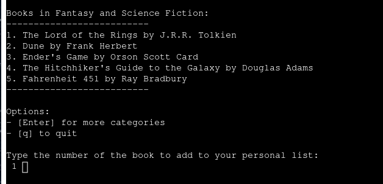

# [LIBSCRAPER](https://libscraper-7100e2e6aa6a.herokuapp.com)

LibScraper is an innovative tool that interfaces with the Google Sheets API to transfer data between spreadsheets. Its primary purpose is to simulate the experience of browsing a curated library, allowing users to explore and select influential books from the past 2000 years.

**Overview**

The virtual library currently features approximately 80 books across 13 categories, representing some of the most impactful literary works in history. While not exhaustive, this collection offers a diverse range of influential texts. 

LibScraper is designed for individuals interested in discovering significant books and compiling a personalized reading list. The tool's appeal lies in its ability to introduce users to important works they might not have encountered otherwise.

## Flowchart 

**A detailed blueprint of LibScraper’s architecture**

The flowchart showcases the program’s primary functionalities and the pathways users can take within the application. It begins with the Main Menu, where users can choose to Search for Books, View Personal List, or Quit the application.

**Search for Books**:

This branch guides users through selecting a category, viewing books within that category, and adding desired books to their personal list. It includes decision points to check for duplicate entries and offers the option to add multiple books sequentially without returning to the main menu each time.

**View Personal List**:

Here, users can view their curated book collection. The flowchart illustrates how the program handles empty lists by notifying the user or allows them to delete books, with the flexibility to remove multiple entries in one session.

**Quit**:

This simply ends the application gracefully.

**DISCLAIMER**

While the flowchart provides a comprehensive overview of LibScraper's core functionalities, the application includes more intuitive navigation options—such as quitting during an action and seamlessly toggling between category and book selections—that would complicate the flowchart if depicted. These enhanced navigation features are detailed in the [Features section](#features) below. Additionally, the system incorporates extensive input validation to ensure all user inputs are correctly handled. These validation processes are not shown in the flowchart but are thoroughly covered in the [TESTING.md](TESTING.md) file.

## Features

### Existing Features

#### Home Menu

The Home Menu serves as the central hub, presenting users with three main options: 

1. Search for books to add
2. View personal list
3. Quit the program

After completing an action (such as adding or deleting a book), users are automatically returned to the Home Menu.

#### Category Selection

When users choose option 1 from the Home Menu, they are presented with a list of book categories. These categories are alphabetically sorted for easy navigation.

#### Book Selection

Each category contains multiple books. Users can select a book by entering its corresponding index number from the displayed list.

#### Adding a book

Upon entering a valid index number, the program confirms that the chosen book has been added to the user's personal list.

#### Duplicate Prevention

To maintain list integrity, the program informs users if they attempt to add a book that already exists in their personal list.By design, the program cannot create duplicates.

#### Viewing Personal List

Users can view their curated list of books by selecting option 2 from the Home Menu.

#### Deleting a Book

To refine their personal list, users can delete books. After choosing to delete, they can select which book to remove or exit the deletion process.

#### Empty List Handling

The program detects when the personal list is empty and prevents users from attempting to delete books from an empty list. This occurs when viewing an empty list or after deleting the last book.

#### User-Friendly Navigation

LibScraper's strength lies in its intuitive navigation. Users can easily toggle between category and book selection. After adding a book, they're prompted to continue adding more, returning to their previous location in the book selection process. Pressing 'enter' during book selection allows for quick navigation back to category selection. 

#### Program Termination

When user chooses to quit, the program displays a farewell message before shutting down.

### Future Features

#### Multi-User Support and Data Management

**Current Limitation**

The most significant drawback of the current implementation is its reliance on a single personal API and Google Sheet. This creates several issues: 

1. No offline access to personal lists
2. Limited to single-user operation
3. Risk of data conflicts with simultaneous users

**Proposed Solutions**

1. Individual User Accounts: Implementing a system where users can register and log in to personal accounts.
2. Dedicated Worksheets: Creating individual worksheets for each user, allowing for truly personal book lists.
3. Scalable Database Solution: Transitioning from Google Sheets to a more robust database system, such as SQL, to handle increased user load and data management.

**Benefits**

- Support for multiple concurrent users
- Improved data integrity and user privacy
- Potential for offline access and list downloads

#### Web-Based Application

To address the limitations of the current terminal-based system, I would consider developing a web-based version of LibScraper. This would offer several advantages: 

- Enhanced accessibility across devices
- Improved user interface and experience
- Easier implementation of user accounts and data management
- Potential for offline functionality and list downloads

#### Expanded Book Collection

**Current State**

The library currently contains approximately 80 books across 13 categories. 

**Future Vision**

Significantly increasing the number of books and categories to create a more comprehensive and diverse library experience. 

**Benefits**

- Enhanced user engagement through a wider selection of books
- Increased utility and appeal to a broader audience of book enthusiasts

#### Full-Text Library Integration

**Concept**

Transforming LibScraper from a book list generator to a full-fledged digital library. 

**Implementation**

- Acquire and integrate full-text versions of books
- Develop a reading interface within the application

#### Potential Business Model

- Transitioning from a free tool to a subscription-based service
- Target audience: Book lovers and academic researchers
- Unique selling point: Curated collection of influential books from the past 2000 years

#### Conclusion

These proposed future features would elevate LibScraper from a simple list-making tool to a comprehensive digital library platform. By addressing current limitations and expanding its functionality, LibScraper has the potential to become a valuable resource for literature enthusiasts and researchers alike, while also presenting a viable business opportunity in the digital content space. This is the power of technology in general. 

## Tools & Technologies Used

-  used to generate README and TESTING templates.
-  used for version control. (`git add`, `git commit`, `git push`)
-  used for secure online code storage.
-  used as my local IDE for development.
-  used as the back-end programming language.
-  used for hosting the deployed back-end site.
-  used for storing data.
-  used to help debug, troubleshoot, and explain things.

## Data Model

### Imports

I've used the following Python packages and external imported packages.

- `gspread`: used with the Google Sheets API
- `google.oauth2.service_account`: used for the Google Sheets API credentials
- `os`: used for adding a `clear()` function

## Testing

> [!NOTE]  
> For all testing, please refer to the [TESTING.md](TESTING.md) file.

## Deployment

Code Institute has provided a [template](https://github.com/Code-Institute-Org/python-essentials-template) to display the terminal view of this backend application in a modern web browser.
This is to improve the accessibility of the project to others.

The live deployed application can be found deployed on [Heroku](https://libscraper-7100e2e6aa6a.herokuapp.com).

### Heroku Deployment

This project uses [Heroku](https://www.heroku.com), a platform as a service (PaaS) that enables developers to build, run, and operate applications entirely in the cloud.

Deployment steps are as follows, after account setup:

- Select **New** in the top-right corner of your Heroku Dashboard, and select **Create new app** from the dropdown menu.
- Your app name must be unique, and then choose a region closest to you (EU or USA), and finally, select **Create App**.
- From the new app **Settings**, click **Reveal Config Vars**, and set the value of KEY to `PORT`, and the value to `8000` then select *add*.
- If using any confidential credentials, such as CREDS.JSON, then these should be pasted in the Config Variables as well.
- Further down, to support dependencies, select **Add Buildpack**.
- The order of the buildpacks is important, select `Python` first, then `Node.js` second. (if they are not in this order, you can drag them to rearrange them)

Heroku needs three additional files in order to deploy properly.

- requirements.txt
- Procfile
- runtime.txt

You can install this project's **requirements** (where applicable) using:

- `pip3 install -r requirements.txt`

If you have your own packages that have been installed, then the requirements file needs updated using:

- `pip3 freeze --local > requirements.txt`

The **Procfile** can be created with the following command:

- `echo web: node index.js > Procfile`

The **runtime.txt** file needs to know which Python version you're using:
1. type: `python3 --version` in the terminal.
2. in the **runtime.txt** file, add your Python version:
	- `python-3.9.19`

For Heroku deployment, follow these steps to connect your own GitHub repository to the newly created app:

Either:

- Select **Automatic Deployment** from the Heroku app.

Or:

- In the Terminal/CLI, connect to Heroku using this command: `heroku login -i`
- Set the remote for Heroku: `heroku git:remote -a app_name` (replace *app_name* with your app name)
- After performing the standard Git `add`, `commit`, and `push` to GitHub, you can now type:
	- `git push heroku main`

The frontend terminal should now be connected and deployed to Heroku!

### Local Deployment

This project can be cloned or forked in order to make a local copy on your own system.

For either method, you will need to install any applicable packages found within the *requirements.txt* file.

- `pip3 install -r requirements.txt`.

If using any confidential credentials, such as `CREDS.json` or `env.py` data, these will need to be manually added to your own newly created project as well.

#### Cloning

You can clone the repository by following these steps:

1. Go to the [GitHub repository](https://github.com/D0bledore/LibScraper) 
2. Locate the Code button above the list of files and click it 
3. Select if you prefer to clone using HTTPS, SSH, or GitHub CLI and click the copy button to copy the URL to your clipboard
4. Open Git Bash or Terminal
5. Change the current working directory to the one where you want the cloned directory
6. In your IDE Terminal, type the following command to clone my repository:
	- `git clone https://github.com/D0bledore/LibScraper.git`
7. Press Enter to create your local clone.

Alternatively, if using Gitpod, you can click below to create your own workspace using this repository.

Please note that in order to directly open the project in Gitpod, you need to have the browser extension installed.
A tutorial on how to do that can be found [here](https://www.gitpod.io/docs/configure/user-settings/browser-extension).

#### Forking

By forking the GitHub Repository, we make a copy of the original repository on our GitHub account to view and/or make changes without affecting the original owner's repository.
You can fork this repository by using the following steps:

1. Log in to GitHub and locate the [GitHub Repository](https://github.com/D0bledore/LibScraper)
2. At the top of the Repository (not top of page) just above the "Settings" Button on the menu, locate the "Fork" Button.
3. Once clicked, you should now have a copy of the original repository in your own GitHub account!

### Local VS Deployment

**Heroku Performance**

The deployed version of LibScraper on Heroku may experience slower response times compared to running the application locally. This performance difference is notable and can impact the overall user experience. 

**Local Execution Recommendation** 

For optimal performance, I encourage you to run LibScraper locally on your own machine. This can be achieved by: 

1. Downloading or copying the run.py file
2. Ensuring all dependencies listed in the requirements.txt file are installed
3. Executing the script in a local Python environment

Running LibScraper locally typically results in faster response times and a smoother overall experience. 

## Credits

### Content

| Source | Location | Notes |
| --- | --- | --- |
|  | README and TESTING | tool to help generate the Markdown files |
|  | run.py | used to help debug and troubleshoot | 
|  | run.py |  |
|  | run.py |  | 

### Acknowledgements

I would like to express my heartfelt gratitude to my Code Institute mentor, [Tim Nelson](https://github.com/TravelTimN), for his unwavering support and guidance throughout the development of this project. His expertise and encouragement have been invaluable.

I am also deeply thankful to the [Code Institute](https://codeinstitute.net) for providing me with this incredible opportunity to advance my career. The skills and knowledge I have gained through this program have been transformative.

Lastly, I want to extend my deepest appreciation to my partner, **Rose**, for her unwavering belief in me. Her encouragement led me to discover the Code Institute and apply for the Full-Stack Software Development Course, which has been a pivotal step in my professional journey.

Last but not least, I thank God for providing me with the strength and perseverance to complete this project, especially while managing the demands of a tough job alongside my studies.