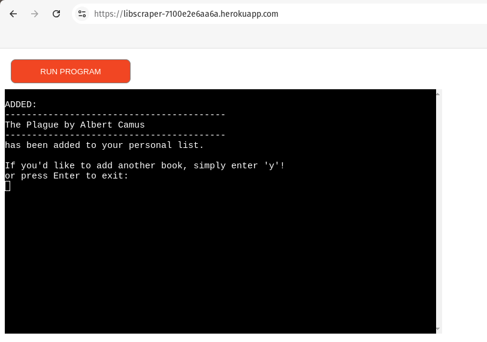
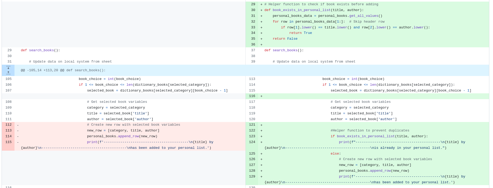

# Testing

> [!NOTE]  
> Return back to the [README.md](README.md) file.

## Code Validation

### Python

I have used the recommended [PEP8 CI Python Linter](https://pep8ci.herokuapp.com) to validate all of my Python files.

| Directory | File | CI URL | Screenshot | Notes |
| --- | --- | --- | --- | --- |
|  | run.py | [PEP8 CI](https://pep8ci.herokuapp.com/https://raw.githubusercontent.com/D0bledore/LibScraper/main/run.py) |  | No Errors |

## Browser Compatibility

I've tested my deployed project on multiple browsers to check for compatibility issues.

- [Ungoogled Chrome](https://github.com/ungoogled-software/ungoogled-chromium)
- [Firefox](https://www.mozilla.org/en-US/firefox/download/thanks/)
- [Brave](https://brave.com/download)
- [Opera](https://www.opera.com/download)

| Browser | Home | Search | View | Add | Delete | Quit | Notes |
| --- | --- | --- | --- | --- | --- | --- | --- |
| Ungoogled Chrome |  |  |  |  |  |  | Works as expected |
| Firefox |  |  |  |  |  |  | Works as expected |
| Brave |  |  |  |  |  |  | Works as expected |
| Opera |  |  |  |  |  |  | Works as expected |

## Defensive Programming

This section illustrates the robust input validation mechanisms implemented in my program. The system is designed to provide clear guidance to users regarding available options while strictly enforcing input constraints.

My validation technique effectively handles both type checking (ensuring the input is a number or a valid option) and range checking (ensuring the number corresponds to an existing book). My code also provides clear feedback to the user in case of errors and confirms successful operations. My approach contributes to a robust and user-friendly interface for managing the personal book list.

| Place of occurence |Int validation | String validation |
| --- | --- | --- | 
| Home |  |  |
| Category select |  |  |
| Book select |  |  |
| Add another book? |  |  |
| Viewing personal list |  |  |
| Deleting |  |  |

**No Book to delete**

If the personal list is empty, the program will detect this condition, inform the user, and return them to the home menu without presenting any other options.

## Bugs

1. **Infinite Loop After Failed Deletion Attempt**

**Issue**: The program was stuck in a loop that continued even after a rejected or failed deletion attempt.

**Solution**: A break statement was added to exit the loop when a deletion fails, preventing an infinite loop scenario. 

2. **Preventing Deletion from Empty Personal List**

**Issue**: Users could attempt to delete books from an empty personal list, leading to confusion.

**Solution**: The functionality for viewing the personal list and deleting a book was separated. The view_personal_list function now returns a boolean value indicating whether the list contains entries. This value is checked before allowing deletion, ensuring users can't attempt to delete from an empty list and preventing potential confusion. 

3. **Preventing Duplicate Entries**

**Issue**: The personal list worksheet could contain duplicate book entries, which was contrary to the program's purpose.

**Solution**: A helper function was implemented to compare the title and author of a selected book against all books already in the personal list. If a match is found, the function returns True, skipping the addition process and notifying the user. This prevents duplicate entries and maintains the integrity of the personal list.

 

4. **'q' Not Exiting Category Selection**

**Issue**: The 'q' option failed to exit the user from the category selection process as intended.

**Solution**: The input validation for the 'q' option was moved from within the function to the outer loop where the function is called. This ensures that selecting 'q' breaks the entire selection process, not just the function, allowing users to exit as expected.

5. **F-string Functionality Lost in Multi-line Print Statement**

**Issue**: The f-string functionality was lost when using multiple lines for a print statement.

    

    

**Solution**: The 'f' prefix was added to each line of the multi-line print statement. This ensures that all lines are properly interpreted as f-strings, maintaining the intended string formatting throughout the statement. 

6. **Python `E501 line too long` (80 > 79 characters)**

**Issue**: The Python linter reported E501 errors for lines exceeding 79 characters.

**Solution**: The line length was reduced, and parentheses were used to continue lines where necessary. This adjustment adheres to PEP 8 style guidelines, improving code readability while maintaining functionality.

## Unfixed Bugs

> [!NOTE]  
> There are no remaining bugs that I am aware of.
